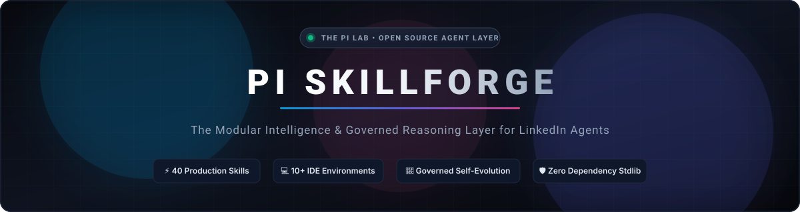

<div align="center">

<br />

<p align="center">
  
</p>

# ✦ PI SKILLFORGE

### The Modular Intelligence & Reasoning Layer for LinkedIn Workflows

<p align="center">
  <b>40 Production Skills</b> &nbsp;•&nbsp; 
  <b>10+ Supported IDEs</b> &nbsp;•&nbsp; 
  <b>Governed Self-Evolution</b> &nbsp;•&nbsp; 
  <b>Zero Runtime Dependencies</b>
</p>

<br />

[](LICENSE)
[](skills/)
[](ide/)
[](pyproject.toml)
[](SECURITY.md)

<br />

[Explore Skills](#-the-40-skill-matrix) •
[Quickstart](#-quickstart-in-60-seconds) •
[Architecture](#-architectural-paradigm) •
[IDE Installation](#-universal-ide-deployment) •
[Evolution Engine](#-governed-self-evolution) •
[Compliance](#-enterprise-safety--compliance)

<br />

---

### *“Prompts are volatile scripts. Skills are enduring infrastructure.”*

</div>

<br />

Most AI agents fail at real-world LinkedIn execution not because models lack intelligence, but because prompts conflate **reasoning methodology** with **API mechanics**. When models hallucinate tool capabilities or drift silently over time, mission-critical workflows shatter.

**PI SkillForge** decouples what an agent **thinks** from how an agent **executes**. It provides 40 battle-tested, contract-governed reasoning modules—complete with typed schemas, adversarial evaluations, degradation guarantees, and a mathematically sound, human-supervised self-evolution loop.

<br />

```
       INTENT                      INTELLIGENCE LAYER                     EXECUTION LAYER
 ╭─────────────────╮          ╭───────────────────────────╮          ╭───────────────────────╮
 │  "Find VP Leads │          │       PI SKILLFORGE       │          │   Swappable Adapters  │
 │  & Send Tailored│ ───────▶ │   Reasoning Methodology   │ ───────▶ │   API · CRM · Browser │
 │    Outreach"    │          │  JSON Schemas + Guardrails│          │  Claude · Cursor · DB │
 ╰─────────────────╯          ╰───────────────────────────╯          ╰───────────────────────╯
                                            │
                                ┌───────────┴───────────┐
                                ▼                       ▼
                       [ Evidence Logging ]   [ Governed Evolution ]
```

<br />

---

## ⚡ Key Highlights

<table>
<tr>
<td width="50%" valign="top">

### 🧩 100% Portable & Self-Contained
Every skill is packaged with a strict 27-section `SKILL.md`, Draft 2020-12 `schema.json`, reproducible usage examples, and adversarial evaluation suites. Drop them into Claude Code, Cursor, Windsurf, or your custom agent runtime instantly.

</td>
<td width="50%" valign="top">

### 🧬 Governed Self-Evolution
Agents learn without uncontrollable drift. Production run evidence converts into scorecards and bounded proposals. Every release must pass semantic versioning, audit trail verification, and automated rollback gates.

</td>
</tr>
<tr>
<td width="50%" valign="top">

### 🔌 Swappable Adapter Boundary
Skills interact with abstract capability interfaces (`search()`, `get_profile()`, `send_message()`, etc.). If a tool or API credential is absent, the skill automatically degrades to analysis-only mode—**never hallucinating actions**.

</td>
<td width="50%" valign="top">

### 🛡️ Enterprise Safety & Compliance
Explicitly rejects session hijacking, cookie theft, aggressive automation evasion, rate-limit bypassing, and brute-force mass spam. Designed from the ground up for strict LinkedIn compliance, human oversight, and auditability.

</td>
</tr>
</table>

<br />

---

## 🏛️ Architectural Paradigm

Standard prompts are fragile strings. PI SkillForge enforces a clean, dual-layer separation:

```
┌────────────────────────────────────────────────────────────────────────────────────────┐
│                                  STABLE INTELLIGENCE                                   │
│            Workflow Logic · Decision Trees · Quality Heuristics · Output Contracts     │
└────────────────────────────────────────────────────────────────────────────────────────┘
                                            │
                                  [ Draft 2020-12 Schema ]
                                            │
┌────────────────────────────────────────────────────────────────────────────────────────┐
│                                  SWAPPABLE EXECUTION                                   │
│       Official LinkedIn API · Unofficial Connectors · HubSpot · Salesforce · Browser    │
└────────────────────────────────────────────────────────────────────────────────────────┘
```

### Why this changes everything:
1. **Zero Provider Lock-In**: Upgrade your LLM from Claude 3.5 Sonnet to GPT-4o or Gemini 1.5 Pro without rewriting your LinkedIn logic.
2. **Context-Preserving Handoffs**: When multiple skills chain together, every output carries structured provenance metadata:

```json
{
  "data": { "target_prospect_tier": "Tier-1", "recommended_hook": "Shared IEEE keynote" },
  "provenance": {
    "producer_skill": "linkedin.prospect-research",
    "producer_version": "1.0.0",
    "produced_at": "2026-09-28T12:00:00Z",
    "confidence": 0.94,
    "gaps": ["Personal email unavailable; verified work email attached"],
    "assumptions": ["Lead is currently active in current company role"]
  }
}
```

Downstream skills never act on hidden assumptions or silent uncertainties.

<br />

---

## 🗂️ The 40-Skill Matrix

The catalog spans the complete LinkedIn operational lifecycle across 10 specialized capability domains:

<details open>
<summary><b>Click to expand / collapse the full skills catalog</b></summary>
<br />

| Domain | Skills Included | Core Purpose |
| :--- | :--- | :--- |
| **Foundation** | [`profile-optimization`](skills/profile-optimization) · [`personal-branding`](skills/personal-branding) · [`linkedin-seo`](skills/linkedin-seo) | Maximize discoverability, authority, headline impact, and algorithm indexing. |
| **Content Engine** | [`content-creation`](skills/content-creation) · [`copywriting`](skills/copywriting) · [`ai-content-generation`](skills/ai-content-generation) · [`algorithm-optimization`](skills/algorithm-optimization) · [`content-scheduling`](skills/content-scheduling) | Produce scroll-stopping thought leadership, hook structures, and dwell-time optimization. |
| **Prospecting** | [`lead-generation`](skills/lead-generation) · [`sales-navigator`](skills/sales-navigator) · [`prospect-research`](skills/prospect-research) · [`b2b-prospecting`](skills/b2b-prospecting) · [`lead-qualification`](skills/lead-qualification) | Identify high-intent accounts, map buying committees, and qualify prospects rigorously. |
| **Outreach** | [`outreach-automation`](skills/outreach-automation) · [`cold-messaging`](skills/cold-messaging) · [`connection-strategy`](skills/connection-strategy) · [`social-selling`](skills/social-selling) · [`ai-personalization`](skills/ai-personalization) · [`appointment-setting`](skills/appointment-setting) · [`email-outreach-integration`](skills/email-outreach-integration) | Transform cold prospects into warm conversations with hyper-personalized, non-spammy touchpoints. |
| **Strategy** | [`sales-funnel`](skills/sales-funnel) · [`abm`](skills/abm) · [`growth-strategy`](skills/growth-strategy) · [`engagement-strategy`](skills/engagement-strategy) | Account-based marketing orchestration, pipeline velocity, and audience retention loops. |
| **Automation** | [`ai-agent-development`](skills/ai-agent-development) · [`workflow-automation`](skills/workflow-automation) · [`automation-compliance`](skills/automation-compliance) | Architect autonomous multi-agent systems with safety interlocks and rate-limit guardrails. |
| **Data & CRM** | [`crm-integration`](skills/crm-integration) · [`data-enrichment`](skills/data-enrichment) | Bi-directional synchronization with HubSpot, Salesforce, and Apollo/Clearbit data lakes. |
| **Analytics & Intel** | [`analytics-reporting`](skills/analytics-reporting) · [`competitor-analysis`](skills/competitor-analysis) · [`market-research`](skills/market-research) · [`conversion-tracking`](skills/conversion-tracking) | Monitor post performance, competitor audience gaps, and pipeline conversion attribution. |
| **Talent & Career** | [`recruitment-automation`](skills/recruitment-automation) · [`job-search-optimization`](skills/job-search-optimization) · [`employer-branding`](skills/employer-branding) | Source top-percentile engineering/business talent and position company culture attractively. |
| **Paid Campaigns** | [`ads-management`](skills/ads-management) · [`campaign-optimization`](skills/campaign-optimization) · [`api-integration`](skills/api-integration) | LinkedIn Ads budgeting, matched audience targeting, CTR optimization, and API bridging. |

</details>

<br />

---

## 🚀 Quickstart in 60 Seconds

You don't need heavyweight frameworks, node dependencies, or complex setup scripts. PI SkillForge runs cleanly on pure Python standard library.

### 1. Clone the repository
```bash
git clone https://github.com/the-pi-lab/pi-skillforge.git
cd pi-skillforge
```

### 2. Verify repository integrity
```bash
python -m unittest discover -s tests -p "test_*.py" -v
```
```text
Ran 2 tests in 0.803s
OK
PASS: ide registry >= 10 hosts
PASS: evolution layers healthy
PASS: all 40 skills conform to SKILL_SPEC §12
```

### 3. Inspect any skill
Each skill folder contains everything required for immediate reasoning:
```bash
ls skills/prospect-research/
# README.md  SKILL.md  examples/  schema.json  tests/
```

<br />

---

## 💻 Universal IDE Deployment

Install any skill directly into your AI coding assistant or IDE with zero friction. The built-in CLI auto-detects your workspace environment and configures the appropriate wiring:

```bash
# Preview installation (Dry-Run mode)
python ide/install.py install --skill prospect-research --ide auto --target /path/to/project

# Apply installation
python ide/install.py install --skill prospect-research --ide auto --target /path/to/project --apply
```

### Supported IDE Environments:

| Target IDE | Target Destination | Status & Integration Details |
| :--- | :--- | :--- |
| **Claude Code** | `.claude/skills/` | `Native Verified` — Automatic discovery via standard `SKILL.md` parser |
| **Cursor** | `.cursor/skills/` | `Community Ready` — Referenced directly by Composer / Cursor Rules |
| **Windsurf** | `.windsurf/skills/` | `Community Ready` — Seamlessly available to Windsurf Cascade memories |
| **VS Code** | `.vscode/skills/` | `Community Ready` — Targeted by GitHub Copilot custom instructions |
| **Cline** | `.cline/skills/` | `Native Ready` — Staged in Cline context hierarchy |
| **Roo Code** | `.roo/skills/` | `Native Ready` — Direct Roo prompt injection |
| **Zed** | `.zed/skills/` | `Native Ready` — Indexed by Zed Assistant context engine |
| **JetBrains** | `.idea/skills/` | `Native Ready` — Configurable in JetBrains AI Assistant |
| **Neovim** | `.nvim/skills/` | `Native Ready` — Compatible with Avante.nvim, CodeCompanion, etc. |
| **Generic Agent** | `linkedin-skills/` | `Universal` — Compatible with LangChain, LlamaIndex, CrewAI, AutoGen |

<br />

---

## 🧬 Governed Self-Evolution

**Uncontrolled AI prompt mutation leads to silent drift.** PI SkillForge pioneers a strictly governed, evidence-backed evolution loop:

```
  ┌──────────────┐     ┌──────────────┐     ┌──────────────┐
  │   OBSERVE    │ ──▶ │    SCORE     │ ──▶ │   PROPOSE    │
  │ Real metrics │     │ Benchmark IQ │     │ Bounded diff │
  └──────────────┘     └──────────────┘     └──────────────┘
         ▲                                         │
         │                                         ▼
  ┌──────────────┐     ┌──────────────┐     ┌──────────────┐
  │   MONITOR    │ ◀── │   RELEASE    │ ◀── │   VALIDATE   │
  │ Drift watch  │     │ Human signoff│     │ Schema gates │
  └──────────────┘     └──────────────┘     └──────────────┘
```

### Evolution in action:

1. **Log execution evidence**:
   ```bash
   python evolution/evolve.py record \
     --skill cold-messaging \
     --outcome succeeded \
     --confidence 0.91 \
     --eval-passed \
     --notes "Reviewer approved conversational hook with zero edits"
   ```

2. **Generate skill performance scorecards**:
   ```bash
   python evolution/evolve.py score --skill cold-messaging
   ```

3. **Validate & apply proposed improvements**:
   ```bash
   # Validate proposal against schema, semver, and safety gates
   python evolution/evolve.py validate --proposal evolution/proposals/PROP-2026-001.json

   # Apply with mandatory maintainer sign-off
   python evolution/evolve.py apply --proposal evolution/proposals/PROP-2026-001.json --approve "Maintainer Name" --apply
   ```

> [!IMPORTANT]
> The evolution engine **fails closed**. If an evolution attempt tries to weaken compliance rules, bypass human review gates, or cause backward-incompatible schema breaks without a major version bump, it is rejected automatically.

<br />

---

## 🔌 The Adapter Boundary

Skills express **pure business logic and reasoning requirements**, remaining completely agnostic of low-level API drivers:

```text
 ╭─────────────────────────╮
 │   Cold Messaging Skill  │
 │  Requires:              │
 │   • get_profile()       │
 │   • send_message()      │
 ╰───────────┬─────────────╯
             │ (Abstract Interface)
             ▼
 ╭─────────────────────────╮
 │     Adapter Layer       │
 ╰───────────┬─────────────╯
             │
 ┌───────────┼────────────────────────┐
 ▼           ▼                        ▼
[ Official LinkedIn API ]   [ CRM Webhook (HubSpot) ]   [ Headless Browser ]
```

### Supported Capability Families:
* `get_profile(id)` · `get_company(id)` · `search(query)` · `enrich_contact(data)`
* `send_message(recipient, text)` · `create_appointment(lead, slot)`
* `post_content(body)` · `schedule_post(time, body)` · `get_analytics(metric)`
* `create_crm_record(deal)` · `track_conversion(event)` · `manage_ads(campaign)`

*When no physical tool is configured, the skill operates in **analysis-only fallback mode**, delivering reasoning outputs without crashing or hallucinating.*

<br />

---

## 🛡️ Enterprise Safety & Compliance

PI SkillForge is engineered specifically for compliant, sustainable, professional B2B operations:

- ❌ **Zero Scraping Hacks**: No DOM tampering, session cookie stealing, or CAPTCHA bypass scripts.
- ❌ **Zero Unchecked Mass Spam**: Strict daily volume caps, opt-out compliance, and context verification.
- ✅ **Human-in-the-Loop Interlocks**: Critical actions (sending messages, booking slots, launching ad spend) require explicit operator review.
- ✅ **Audit Trail First**: Every action, reasoning step, and state mutation is logged with cryptographic confidence and origin tracking.

<br />

---

## 🗺️ Repository Structure

```text
pi-skillforge/
├── skills/                     # 40 modular reasoning skill packages
│   ├── cold-messaging/         # (SKILL.md, schema.json, examples, evals)
│   ├── prospect-research/
│   └── ...
├── schemas/                    # Reusable Draft 2020-12 shared JSON entities
├── adapters/                   # Abstract tool contracts & reference implementations
├── ide/                        # Universal CLI installer & multi-IDE registry
├── evolution/                  # Governed self-evolution engine, logs & scorecards
├── examples/composition/       # Multi-skill workflow orchestration blueprints
├── tests/                      # Automated test suite (Python unittest stdlib)
├── docs/                       # Architecture, compliance, security & composition specs
├── CONTRIBUTING.md             # Contribution standards & skill authoring guide
├── LICENSE                     # Permissive MIT License
└── pyproject.toml              # Build & test metadata
```

<br />

---

## 🤝 Contributing

We welcome contributions of new skills, IDE adapters, and tool bridges! Please check our [`CONTRIBUTING.md`](CONTRIBUTING.md) and [`SKILL_SPEC.md`](SKILL_SPEC.md) for guidelines on meeting the 27-section contract and evaluation standards.

```bash
# Verify your contribution meets all spec requirements:
python -m unittest discover -s tests -p "test_*.py" -v
```

<br />

---

<div align="center">

<br />

### Engineered with precision by **The PI Lab**

**Reason better. Compose freely. Evolve responsibly.**

[](https://github.com/the-pi-lab/pi-skillforge)
[](https://github.com/the-pi-lab/pi-skillforge)

<br />

<sub>Open source under the MIT License • Built for the next frontier of intelligent agents.</sub>

<br /><br />

</div>
